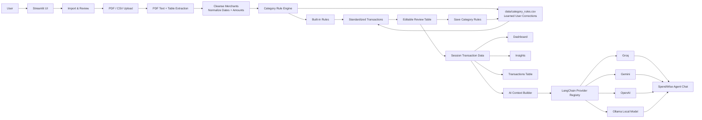
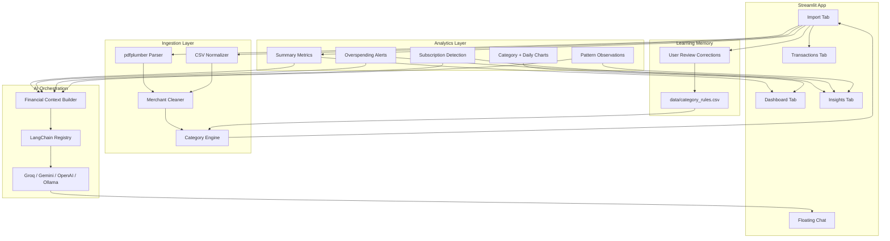

# SpendWise Agent Architecture

## High-Level Flow

## Component View

## Demo Talk Track

SpendWise Agent starts with a bank statement PDF or CSV. The import layer extracts transactions, cleans noisy merchant names, standardizes dates and amounts, and applies categorization rules.

The key design decision is the learning loop. When a user corrects categories in the review table, those corrections are saved to `data/category_rules.csv`. Future statements use those learned rules before falling back to built-in rules, so the agent improves over time.

Once transactions are standardized, the same clean dataset powers the dashboard, insights, transaction table, and AI chat context. The chatbot is model-agnostic through LangChain and can run on Groq, Gemini, OpenAI, or a local Ollama model.

## Why This Architecture Works

- Real bank PDFs are inconsistent, so the app separates extraction from review.
- The dashboard only uses standardized transactions.
- User corrections become persistent rules.
- LLM providers are swappable through one registry.
- Local Ollama support avoids cloud API quota limits.
