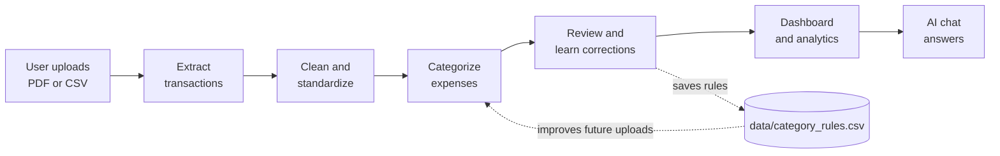
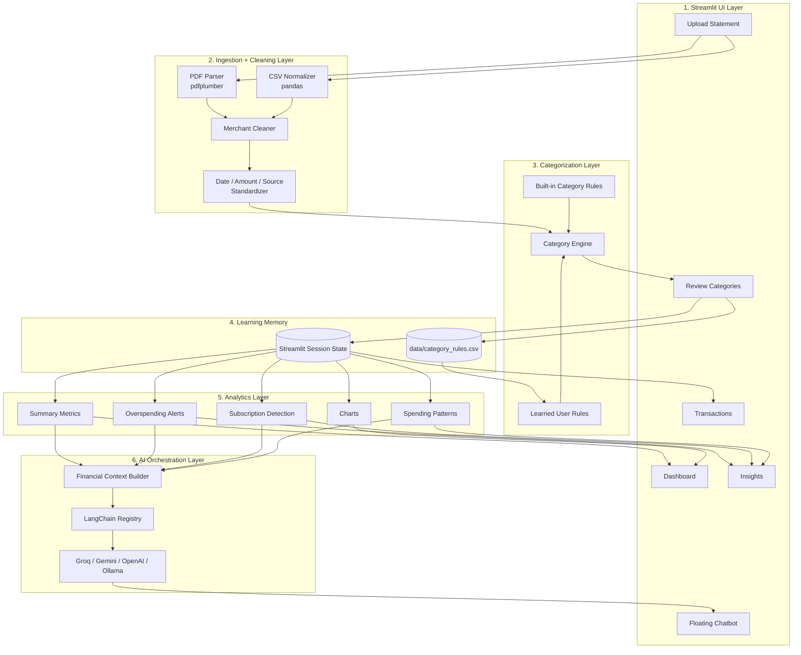

# SpendWise Agent Architecture

SpendWise Agent is a local Streamlit application that turns bank statement PDFs or CSV exports into a clean expense dashboard. The app first standardizes messy transaction data, then uses rules, analytics, and an optional LLM provider to generate insights and chatbot answers.

## Simple End-to-End Flow

## Component Architecture

## Component Breakdown

| Component | Purpose | Main Files |
| --- | --- | --- |
| Streamlit UI | Provides upload, review, dashboard, insights, transactions, and floating chatbot screens. | `app.py`, `src/styles.py` |
| Ingestion Layer | Reads PDF and CSV statements, extracts raw transaction rows, and maps them into a common schema. | `src/ingestion.py` |
| Cleaning Layer | Cleans merchant names and standardizes dates, amounts, categories, and source labels. | `src/ingestion.py` |
| Categorization Engine | Applies built-in rules and learned user rules to assign expense categories. | `src/ingestion.py`, `data/category_rules.csv` |
| Learning Memory | Stores user category corrections so future uploads become more accurate. | `data/category_rules.csv`, `st.session_state` |
| Analytics Layer | Calculates spend totals, daily averages, category totals, subscriptions, alerts, and trends. | `src/analytics.py` |
| AI Context Builder | Converts the current financial data into a compact summary for the chatbot. | `src/ai.py` |
| LLM Orchestrator | Lets the app switch between Groq, Gemini, OpenAI, or Ollama without changing the UI logic. | `src/llm.py` |
| Tests | Verifies ingestion, analytics, recurring charge detection, and AI context behavior. | `tests/` |

## Data Flow

1. The user uploads a bank statement as a PDF or CSV.
2. The ingestion layer extracts transactions and converts them into the standard format: `date`, `merchant`, `category`, `amount`, and `source`.
3. The categorization engine applies learned user rules first, then built-in fallback rules.
4. The user can review and correct categories before using the dashboard.
5. Corrected categories are saved to `data/category_rules.csv`.
6. The clean transaction data powers charts, alerts, subscription detection, insights, and chatbot answers.

## Demo Explanation

SpendWise Agent is designed around one important idea: real bank statements are messy, so the app does not trust raw PDF data immediately. It first extracts, cleans, categorizes, and lets the user review the result.

Once the data is standardized, the same clean transaction table powers every feature: dashboard metrics, spending charts, subscriptions, alerts, insights, and the floating AI chatbot.

The app also learns from the user. When a user fixes a merchant category, that correction is saved as a rule. The next time a similar statement is uploaded, SpendWise Agent can categorize it more accurately.

## Why This Design Works

- Separates messy PDF extraction from clean dashboard calculations.
- Gives the user a review step before analytics are trusted.
- Learns from corrections instead of relying only on one-time AI guesses.
- Keeps uploaded data local in the Streamlit session.
- Makes LLM providers swappable through LangChain.
- Supports local open-weight models through Ollama to reduce API cost.
