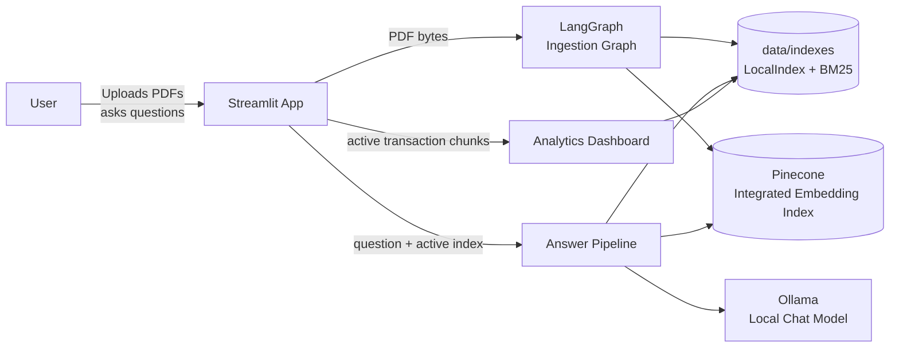
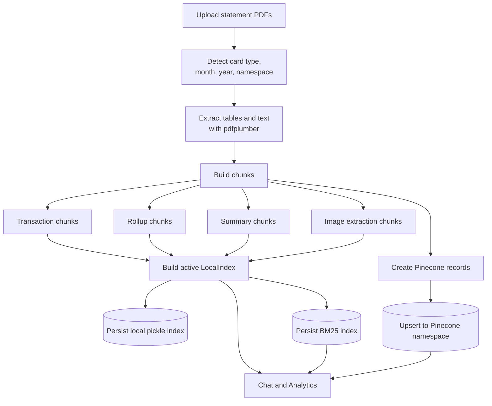
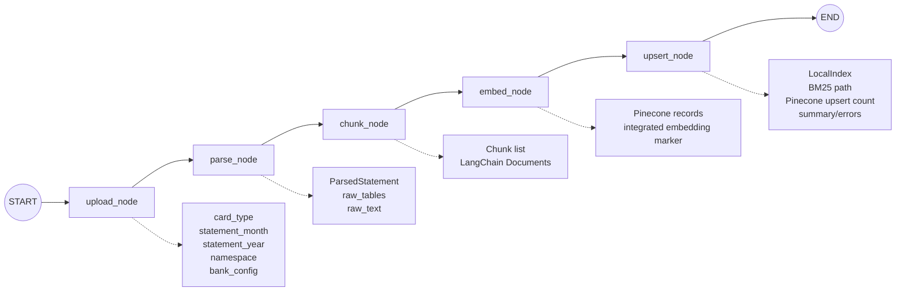
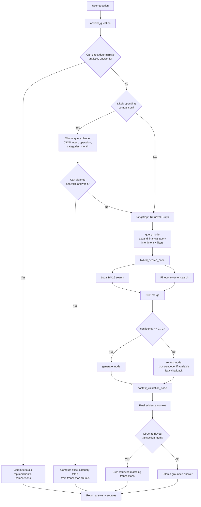
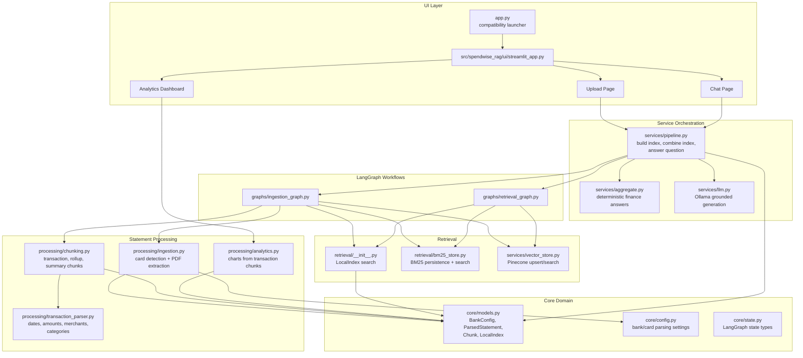
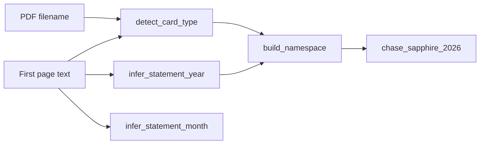
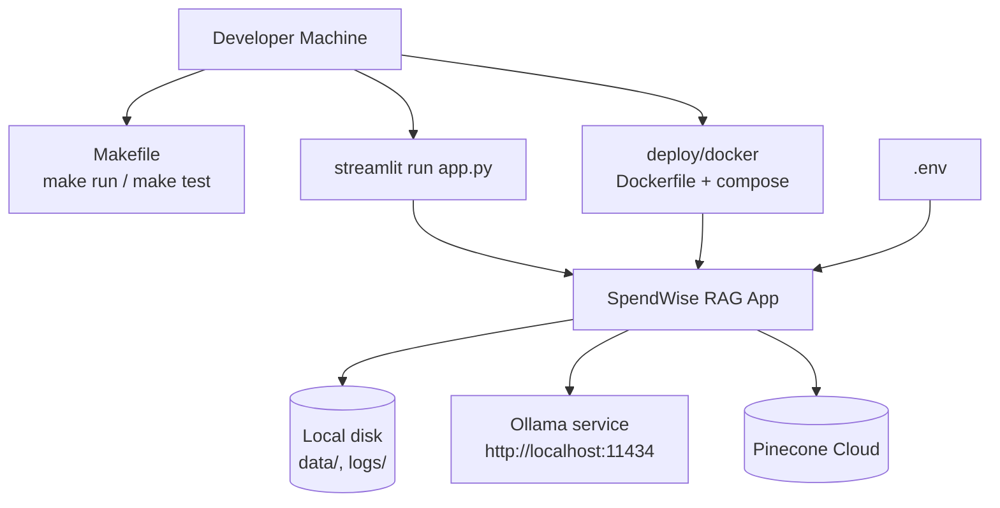
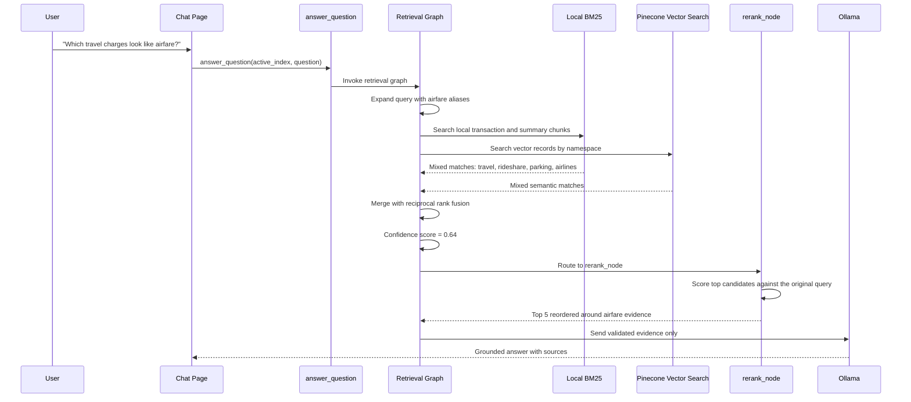

# SpendWise RAG Architecture

SpendWise RAG is a local-first Streamlit application for asking grounded questions over personal bank and credit-card statements. It ingests uploaded PDF statements, parses transaction and summary text, creates searchable chunks, stores local and vector indexes, and answers questions only from retrieved statement evidence.

## System Context



## End-to-End Runtime Flow



## Ingestion Graph

Implemented in `src/spendwise_rag/graphs/ingestion_graph.py`.



## Retrieval And Answering Flow

Implemented across `services/pipeline.py`, `graphs/retrieval_graph.py`, `services/aggregate.py`, and `services/llm.py`.



## Component Architecture



## Data Stores And External Services

| Store or service | Purpose | Used by |
| --- | --- | --- |
| Streamlit session state | Holds the active in-memory `LocalIndex`, ingestion summaries, chat history, and last sources for the current app session. | `ui/streamlit_app.py` |
| `data/indexes/{namespace}.pkl` | Serialized local index containing chunks and tokenized chunk text. | Ingestion graph, pipeline |
| `data/indexes/{namespace}_bm25.pkl` | Persisted BM25 payload for lexical retrieval. | Ingestion graph, retrieval graph |
| Pinecone index | Stores text records with integrated embeddings in a card/year namespace. | `services/vector_store.py` |
| Ollama | Generates grounded natural-language answers from retrieved evidence. | `services/llm.py` |
| `.env` / environment variables | Configures Ollama and Pinecone. | UI, vector store, LLM service |

## Important Runtime Namespaces



Namespaces are built from the detected card type and statement year. They are used for local index filenames, BM25 filenames, chunk metadata, and Pinecone namespaces.

## Deployment View



## Request Paths

| User action | Primary path | Output |
| --- | --- | --- |
| Upload PDFs | Streamlit Upload page -> `build_local_index` -> ingestion graph -> local/BM25/Pinecone indexes | Active combined session index and upsert summary |
| Ask aggregate question | Chat page -> `answer_question` -> deterministic aggregate service | Exact totals, top merchants, or category comparisons with source transactions |
| Ask ambiguous comparison | Chat page -> Ollama query planner -> deterministic aggregate service | LLM maps natural language to categories; code computes exact winner |
| Ask semantic question | Chat page -> retrieval graph -> BM25 + Pinecone -> rerank/validate -> Ollama | Grounded answer with source chunks, confidence, faithfulness, and diagnostics |
| View dashboard | Analytics page -> transaction chunks -> pandas/Plotly analytics | Category, monthly trend, and merchant charts |

## Reranker Applied Scenario

The reranker is applied when the first hybrid retrieval pass finds possible matches, but the confidence score is below `0.70`. In that case, the retrieval graph routes from `hybrid_search_node` to `rerank_node` before validating the final context.



Example user question:

```text
Which travel charges look like airfare?
```

Why this can trigger reranking:

- The query is semantic rather than exact arithmetic, so deterministic analytics does not answer it first.
- `airfare` expands to aliases such as `Frontier Airlines`, `Delta Air Lines`, `American Airlines`, `Spirit Airlines`, `flight`, and `airline`.
- BM25 and Pinecone may return a mixed set of travel-related chunks, including rideshare, parking, hotel, and airline transactions.
- If the top merged result does not overlap strongly enough with the query terms, `_confidence_from_results` can score below `0.70`.
- The graph then applies `rerank_node`, using `cross-encoder/ms-marco-MiniLM-L-6-v2` when available and lexical reranking as a fallback.

Expected UI diagnostics after this path:

| Field | Expected value |
| --- | --- |
| `rerank_used` | `Y` / `true` |
| `confidence` | Often below `0.70` before rerank routing |
| `model_provider` | Usually `ollama`, unless retrieved transaction math handles the answer |
| Sources | Reordered to prioritize the chunks most relevant to airfare |

## Leadership Demo Talk Track

### Slide 1: What SpendWiseRAG Does

SpendWiseRAG turns bank and credit-card statements into a grounded financial assistant.

Core message:

> This is not just a chatbot over PDFs. It is a controlled financial reasoning pipeline that uses exact code for math, search for evidence, and an LLM only where language understanding is useful.

The system supports:

- Statement upload and parsing.
- Transaction-level search.
- Category totals and comparisons.
- Merchant ranking.
- Semantic questions such as `airfare`, `food delivery`, or `streaming`.
- Source citations and retrieval diagnostics for every answer.

### Slide 2: Main Libraries And Their Roles

| Library or service | Role in the system | Demo explanation |
| --- | --- | --- |
| Streamlit | Web UI for upload, chat, diagnostics, and sources. | Gives users a simple app experience without building a custom frontend. |
| LangGraph | Orchestrates ingestion and retrieval as explicit node-based workflows. | Makes the pipeline observable, testable, and easy to explain. |
| pdfplumber | Extracts statement text and tables from PDFs. | Converts raw PDF statements into machine-readable transaction data. |
| pandas | Performs deterministic financial analytics. | Exact totals, comparisons, and rankings are computed in code, not guessed by an LLM. |
| rank-bm25 | Local keyword search over chunks. | Finds exact merchant names, dates, amounts, and category words. |
| Pinecone | Vector database for semantic retrieval. | Finds meaning-based matches, such as `airfare` matching airline charges. |
| Ollama / LangChain Ollama | Local LLM for query planning and grounded answer generation. | Used for language interpretation, not unchecked financial math. |
| sentence-transformers CrossEncoder | Optional reranker for low-confidence retrieval. | Reorders candidate evidence when first-pass retrieval is uncertain. |

### Slide 3: Why The Pipeline Starts With Deterministic Analytics

The first check asks:

```text
Can code answer this exactly?
```

Examples:

```text
How much did I spend on dining?
What are my top 5 merchants by total spend?
Compare groceries vs dining.
```

These questions are answered from parsed transaction chunks using deterministic analytics.

Leadership message:

> For financial math, exact computation is safer than generation. The LLM does not calculate totals when the transaction table can do it exactly.

Typical diagnostics:

```text
Confidence: 0.99
Faithfulness: 1.00
Rerank used: N
Model provider: deterministic_analytics
```

### Slide 4: How The LLM Planner Is Used Safely

Some questions are phrased naturally but still map to structured analytics.

Example:

```text
Which transactions look like transportation expenses?
```

The planner may map this to categories such as:

```text
Ride Share vs Auto
```

Then code computes the exact category totals.

Leadership message:

> The LLM is used as a planner. It converts messy language into structured intent, then deterministic code performs the calculation.

This is why some natural questions still show:

```text
Rerank used: N
Model provider: llm_planned_deterministic_analytics
```

### Slide 5: Retrieval For Semantic Questions

If deterministic analytics cannot answer, the question enters the LangGraph retrieval pipeline.

The retrieval graph performs:

1. Query expansion.
2. BM25 keyword search.
3. Pinecone vector search.
4. Reciprocal rank fusion.
5. Confidence-based reranking.
6. Context validation.

Example:

```text
Show me all airfare charges and the total amount.
```

`airfare` may not literally appear in the statement. The query node expands it to known airline terms and merchants:

```text
Frontier Airlines, Delta Air Lines, American Airlines, Spirit Airlines, flight, airline
```

Leadership message:

> BM25 gives precision. Pinecone gives semantic recall. RRF combines them so the final evidence is stronger than either search path alone.

### Slide 6: What RRF Does

RRF means Reciprocal Rank Fusion.

It combines the BM25 result list and the Pinecone result list.

Simple explanation:

> A chunk is trusted more when it ranks highly in either search system, and especially when both systems agree on it.

Why it matters:

- BM25 is strong for exact strings like `Publix`, `$52.75`, or `2026-04-10`.
- Pinecone is strong for meaning-based terms like `airfare`, `streaming`, or `food delivery`.
- RRF gives a balanced ranking without needing either search method to be perfect.

### Slide 7: When Reranking Happens

The reranker is not the default path.

The graph checks:

```text
confidence >= 0.70?
```

If yes:

```text
Rerank used: N
```

If no:

```text
Rerank used: Y
```

Leadership message:

> Reranking is a low-confidence quality-control step. We use it when the first-pass retrieval is uncertain, which helps control latency and cost.

Good reranker demo question:

```text
Find ambiguous merchant names and explain what they might be.
```

### Slide 8: Context Validation Before The LLM

Before the LLM sees anything, the pipeline validates the retrieved context.

It checks:

- Did we retrieve any chunks?
- Do chunks overlap with the original or expanded query?
- Are chunks sourceable with citation numbers?
- Are off-topic chunks blocked?

Leadership message:

> The LLM only receives validated evidence. If the evidence is weak or unrelated, the system returns a no-data response instead of inventing an answer.

### Slide 9: Deterministic Math After Semantic Retrieval

Semantic retrieval finds the relevant transaction rows. Code still performs the arithmetic.

Example:

```text
Show me all airfare charges and the total amount.
```

Expected answer:

```text
Matching charges:
- 2026-04-25 | Frontier Airlines | $68.98 | Travel
- 2026-04-26 | Frontier Airlines | $143.98 | Travel
- 2026-05-08 | Frontier Airlines | $11.20 | Travel
- 2026-05-11 | Frontier Airlines | $134.98 | Travel

Total: $359.14 across 4 transaction(s).
```

Leadership message:

> The vector database helps find the right evidence, but the final total is calculated deterministically from the retrieved transactions.

### Slide 10: What The Diagnostics Mean

| Diagnostic | Meaning | How to explain it |
| --- | --- | --- |
| Confidence | Retrieval or deterministic answer confidence. | Higher means the system found stronger evidence or used exact analytics. |
| Faithfulness | Whether the answer is grounded in available evidence. | `1.00` means the answer is directly supported by transaction data or retrieved chunks. |
| Rerank used | Whether the low-confidence reranker path was used. | `Y` means retrieval needed extra evidence ordering; `N` means the faster path was sufficient. |
| Model provider | Which path produced the answer. | Shows whether the answer came from deterministic analytics, planned analytics, retrieval math, or Ollama. |
| Pinecone vector search | Whether semantic vector retrieval participated. | Confirms if meaning-based search was used and which namespace was queried. |

### Slide 11: Recommended Demo Script

Question 1:

```text
How much did I spend on dining?
```

Say:

> This is answered by deterministic analytics. We avoid LLM math and compute the exact total from parsed transaction chunks.

Question 2:

```text
Show me all airfare charges and the total amount.
```

Say:

> `Airfare` is semantic. Pinecone helps map that concept to airline transactions, then deterministic code calculates the total.

Question 3:

```text
Find ambiguous merchant names and explain what they might be.
```

Say:

> This is less exact, so the system may use reranking before giving the grounded answer. This shows the quality-control path.

Question 4:

```text
What are my top 5 merchants by total spend?
```

Say:

> This is a structured analytics question. The system ranks merchants directly from transactions, which is faster and more reliable than asking an LLM to infer it.

### Slide 12: Executive Summary

SpendWiseRAG uses the right tool for each part of the problem:

- Exact code for financial math.
- BM25 for precise keyword matching.
- Pinecone for semantic retrieval.
- RRF to combine evidence.
- Reranking when confidence is low.
- Context validation before generation.
- Ollama only for grounded language responses or safe query planning.

Final leadership message:

> The architecture is designed for trust. Every answer is either computed exactly from transaction data or generated from validated source evidence.

## Design Notes

- The UI keeps uploaded statement data in the current Streamlit session and combines multiple statement indexes into one active `LocalIndex`.
- Ambiguous spending comparisons can use Ollama as a planner. The planner returns structured intent and category names, but does not answer or calculate totals.
- Deterministic analytics runs before LLM retrieval for totals, comparisons, and top merchant queries so arithmetic stays exact.
- Retrieval is hybrid: local BM25 provides lexical matching, Pinecone provides vector matching, and reciprocal rank fusion merges both result sets.
- If retrieval confidence is low, the graph reranks candidates with a cross-encoder when available, falling back to lexical reranking.
- Ollama only receives selected evidence strings, and the prompt tells the model to answer strictly from that evidence.
- Pinecone is mandatory for vector search. If Pinecone is unavailable or returns no matches, the UI surfaces a visible diagnostic and retrieval continues in degraded BM25-only mode.
